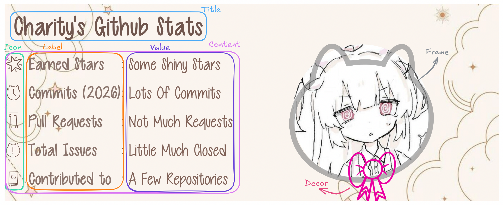
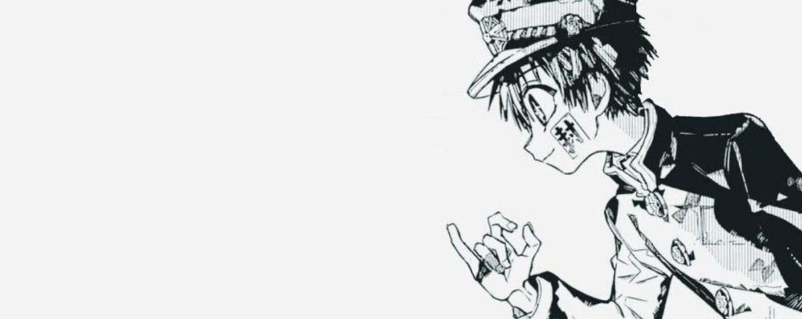

<p align="center">Color fill your README with stylish designs!</p>
<p align="center">
  <a href="#-key-features">Key Features</a> •
  <a href="#-how-to-use">How To Use</a> •
  <a href="#-deploy-yourself">Deploy Yourself</a> •
  <a href="#-credits-and-special-thanks">Credits</a>
</p>

# 💕 Key Features

* ୨ৎ Cute Design!!
  - I have a really good friend who draws for me! As in exchange  i let her to look at outside from the basement's window (˶ᵔᵕᵔ˶)
  - Also she is really good at drawing, please check her page as well! [@mochi_lullaby](https://www.instagram.com/mochi_lullaby)
* ୨ৎ Customization
  - You are the artist you have the palette, **every color** is **modifyable**!!
  - Bunch of fonts are here as your options!
  - Backgrounds? There's not solid colors but there is **images**!!

# 🍓 How To Use??

## GitHub Stats

To generate a **GitHub Stats image** follow this line in your README.md
```md

```
Tadaaa~ If you are seeing me instead, that means you forgot to change `chwrryroll` with your own username... That's a silly mistake!

But what about **customizing**? It's also done with editing URL
You can **style** them by editting the query. Let's say you want to change the **title color**,
The color of the title can be controlled by the `tcolor` parameter...
```md

```
And it will work as you wish, hex colors might not work i'll fix them later!

> ⋆｡‧˚ʚ Note for sillies ɞ˚‧｡⋆ \
> When you want to add multiple parameters, you need to add an '&' between them!! \
> Just like ?tcolor=pink&icolor=rebeccapurple



**ALSO!!** I prepared a table to show which parameter controls which part!! (*ᴗ͈ˬᴗ͈)ꕤ.ﾟ
| Part         | Param  | Default        | Options                               |
|--------------|--------|----------------|---------------------------------------|
| Layout       | layout | qiwq           | qiwq, piwp                            |
| Background   | bg     | spacy          | [Backgrounds list](#backgrounds-list) |
| Avatar Decor | decor  | ribbon         | ribbon                                |
| Avatar Frame | frame  | none           | catface, none                         |
| Icon Pack    | icon   | none           | kitten, none                          |
| Title Font   | tfont  | lilian         | [Fonts list](#fonts-list)             |
| Content Font | cfont  | cutie-patootie | [Fonts list](#fonts-list)             |
| Title Color  | tcolor | #70564E        | (any css color)                       |
| Icon Color   | icolor | #70564E        | (any css color)                       |
| Label Color  | lcolor | #8a746C        | (any css color                        |
| Value Color  | vcolor | #806258        | (any css color)                       |
| Frame Color  | fcolor | #828282        | (any css color)                       |
| Decor Color  | dcolor | #EB00A1        | (any css color)                       |
| Decor Pose X | dposeX | 35%            | (any css unit thingy)                 |
| Decor Pose Y | dposeY | 75%            | (any css unit thingy)                 |

### Backgrounds List

| ID                    | Preview                                                                    |
|-----------------------|----------------------------------------------------------------------------|
| `light`               |                |
| `pinky-promise-left`  |   |
| `pinky-promise-right` |  |
| `spacy`               |                |

### Fonts List

| ID                       | Preview                                                                       |
|--------------------------|-------------------------------------------------------------------------------|
| `cutie-patootie`         |          |
| `lilian`                 |                  |
| `please-write-me-a-song` |  |
| `slopness`               |                |

# ✨ Deploy Yourself

## Prerequisites

There is some **required softwares** to get started!! Before you begin, **make sure** you have installed the following softwares!!
<p align="center">
  <a href="https://gleam.run/install">Gleam •</a>
  <a href="https://www.erlang.org/downloads">Erlang •</a>
  <a href="https://www.rebar3.org">Rebar3 •</a>
  <a href="https://git-scm.com/downloads">Git •</a>
  <a href="https://direnv.net/docs/installation.html">Direnv</a>
</p>

> For Erlang the latest version is needed, if your package manager doesn't supports the latest one i recommend you to use [BEAMUP](https://tsloughter.github.io/beamup) or [Mise](https://mise.jdx.dev/demo.html) instead of building it from the source.

## Clone and prepare

```sh
git clone https://github.com/chwrryroll/chlorophyll.git
cd chlorophyll
```

## Set Environment

There is an environment file to store **sensitive** data!! Create a file named **.envrc** and add the following line
```envrc
export GITHUB_TOKEN=SUPER-SECRET-TOKEN
```
This token is required by the GitHub service for requesting data, also there's a [documentation](https://docs.github.com/en/authentication/keeping-your-account-and-data-secure/managing-your-personal-access-tokens#creating-a-personal-access-token-classic) that explains how to get that token!!

## Run

That was the all, just run `gleam run` and visit `http://0.0.0.0:8080` when you are ready!

# 🎀 Credits And Special Thanks

- Hosting by [**7Strawby**](https://7strawby.com)
- Fonts by [**Vanessa Bays**](http://bythebutterfly.com)
- Icons by [**Yumay**](https://www.instagram.com/mochi_lullaby)
- Backgrounds by... I don't know i found them on Pinterest (╥‸╥)
- Idea by [**Anurag Hazra**](https://github.com/anuraghazra)

*And also a lot lot special thanks to [**Lily**](https://whitespace.moe/lily), Chlorophyll won't be possible for me to complete without her help!*
